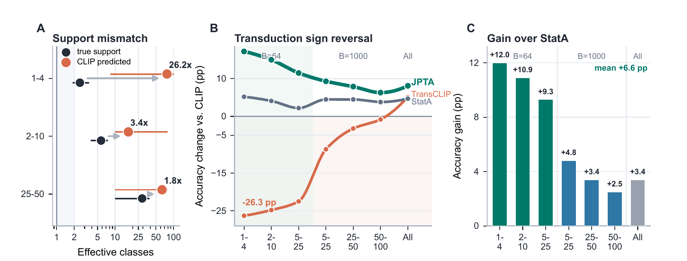

# JPTA: Batch-Conditioned Semantic Anchors for Robust Transductive Adaptation of Vision-Language Models


[](LICENSE)

**Official PyTorch implementation of the NeurIPS 2026 paper
“Batch-Conditioned Semantic Anchors for Robust Transductive Adaptation of Vision-Language Models.”**

**Authors:** Mohammed Rahman Sherif Khan Mohammad, Ardhendu Behera, Sandip Pradhan, Swagat Kumar, Amr Ahmed

**Institution:** Edge Hill University

**Paper:** arXiv preprint coming soon.

JPTA (**Joint Prior and Transport Adaptation**) adapts a frozen CLIP model to an unlabeled test batch. It estimates which classes are present, constructs image-side class prototypes, and moves the text-side semantic references only when the batch provides reliable evidence. The method uses no labeled support examples, parameter updates, or test-time gradients.

## Overview



*Figure 1 from the paper. Sparse batches can make CLIP predict too many active classes (A), causing aggressive transduction to lose accuracy (B). JPTA improves on the fixed-anchor StatA baseline across the seven batch regimes (C).*

JPTA combines four ideas:

1. **Batch-prior estimation** identifies the likely class distribution in the current unlabeled batch.
2. **Soft image prototypes** capture class structure from evolving assignments.
3. **Reliability-controlled transport** adjusts CLIP text prototypes toward that structure while preserving their original semantics.
4. **Prior-aware refinement** couples the transported anchor with local graph consistency and class-marginal control.

The repository focuses on the paper's 11-dataset benchmark: seven independent batch regimes and four online stream regimes.

## Results at a glance

The following are **mean top-1 accuracies across 11 datasets reported in the paper**, using frozen CLIP ViT-B/16. Sampled batch results average 1,000 tasks per dataset and regime; the all-classes setting uses one full-test-set pass. Online results average 100 sampled streams. Gains are in percentage points. The full per-dataset breakdown is in the paper.

### Independent batches

| Effective classes | Batch size | StatA | JPTA | Gain over StatA |
| :--- | ---: | ---: | ---: | ---: |
| Very low (1–4) | 64 | 70.4 | **82.4** | +12.0 |
| Low (2–10) | 64 | 69.3 | **80.2** | +10.9 |
| Medium (5–25) | 64 | 67.4 | **76.7** | +9.3 |
| Medium (5–25) | 1,000 | 69.7 | **74.5** | +4.8 |
| High (25–50) | 1,000 | 69.7 | **73.1** | +3.4 |
| Very high (50–100) | 1,000 | 69.0 | **71.5** | +2.5 |
| All classes | Full test set | 69.9 | **73.3** | +3.4 |

### Online streams

| Stream | Dirichlet γ | StatA | JPTA | Gain over StatA |
| :--- | ---: | ---: | ---: | ---: |
| Low correlation | 0.1 | 67.0 | **72.6** | +5.6 |
| Medium correlation | 0.01 | 68.9 | **74.3** | +5.4 |
| High correlation | 0.001 | 69.5 | **75.2** | +5.7 |
| Classes appear separately | −1 | 69.1 | **75.1** | +6.0 |

## Installation

Use Python 3.10 and a CUDA-capable GPU. The dependency file specifies PyTorch 2.0.1 and torchvision 0.15.2, matching the original experiment workspace. Install builds compatible with your CUDA setup.

```bash
git clone https://github.com/MR-Sherif/JPTA.git
cd JPTA
python -m venv .venv
source .venv/bin/activate
pip install -r requirements.txt
```

On Windows PowerShell, activate the environment with `.venv\Scripts\Activate.ps1`.

## Datasets

Prepare ImageNet, SUN397, FGVC-Aircraft, EuroSAT, Stanford Cars, Food101, Oxford Pets, Flowers102, Caltech101, DTD, and UCF101 under one data root. See [DATASETS.md](DATASETS.md) for the expected directory structure and download instructions. The dataset identifiers accepted by the launcher are `imagenet`, `sun397`, `fgvc`, `eurosat`, `stanford_cars`, `food101`, `oxford_pets`, `oxford_flowers`, `caltech101`, `dtd`, and `ucf101`.

The first run downloads the CLIP ViT-B/16 checkpoint and computes image features. Subsequent runs reuse feature files in `caches/`. Dataset files, model weights, and generated caches are not included in this repository.

## Reproducing the benchmark

Set `DATA_ROOT` to the parent folder containing the 11 datasets. The launcher runs all 11 datasets across the seven batch regimes and four online regimes:

```bash
export DATA_ROOT=/path/to/datasets
python scripts/run_benchmarks.py --data-root "$DATA_ROOT"
```

In PowerShell, set `$env:DATA_ROOT` and pass `$env:DATA_ROOT` to `--data-root`.

The launcher uses ViT-B/16, seed 1, `--alpha 10`, and the template bank configured in the released experiment code. It runs 1,000 tasks for each sampled batch regime, one all-classes pass, and 100 tasks for each online stream. The online batch size is 128. Results are written to `results/<dataset>/<regime>.json`, with a combined `results/summary.csv`.

For a smaller run:

```bash
python scripts/run_benchmarks.py --data-root "$DATA_ROOT" \
  --datasets eurosat oxford_pets \
  --regimes very_low_b64 high_b1000 all_classes online_low
```

To inspect the complete command grid without downloading a model or loading datasets:

```bash
python scripts/run_benchmarks.py --data-root "$DATA_ROOT" --dry-run
```

The reported accuracies above come from the paper. Reproducing them numerically requires the same dataset splits, CLIP weights, software environment, and evaluation protocol; CUDA and dependency differences may cause small deviations.

## Repository layout

| Path | Purpose |
| :--- | :--- |
| [`solvers/JPTA.py`](solvers/JPTA.py) | JPTA transductive solver |
| [`solvers/StatA.py`](solvers/StatA.py) | Statistical routines used by JPTA's fallback |
| [`main.py`](main.py) | One-dataset evaluation entry point |
| [`scripts/run_benchmarks.py`](scripts/run_benchmarks.py) | Full 11-dataset benchmark launcher |
| [`datasets/`](datasets/) and [`clip/`](clip/) | Dataset loading and frozen CLIP features |

## Citation

The arXiv preprint is coming soon. Until final proceedings metadata is available, you can cite the accepted paper as:

```bibtex
@InProceedings{Mohammad_2026_NeurIPS,
    author    = {Mohammad, Mohammed Rahman Sherif Khan and Behera, Ardhendu and Pradhan, Sandip and Kumar, Swagat and Ahmed, Amr},
    title     = {Batch-Conditioned Semantic Anchors for Robust Transductive Adaptation of Vision-Language Models},
    booktitle = {Advances in Neural Information Processing Systems (NeurIPS)},
    year      = {2026}
}
```

## Acknowledgements and license

The evaluation framework builds on StatA by Zanella et al. The bundled CLIP implementation comes from [OpenAI CLIP](https://github.com/openai/CLIP), with its MIT license in [clip/LICENSE](clip/LICENSE). This repository is released under the [AGPL-3.0 license](LICENSE).
